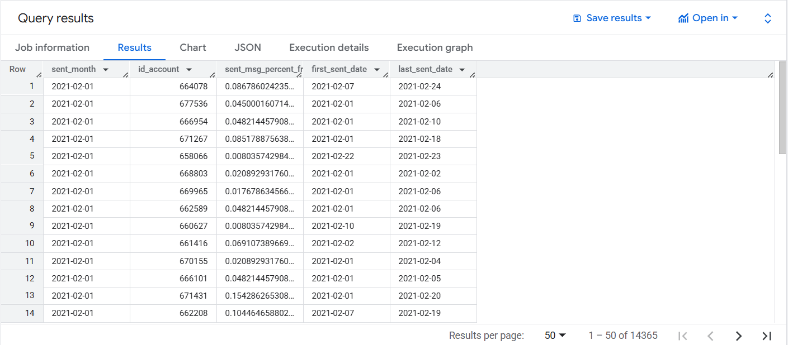
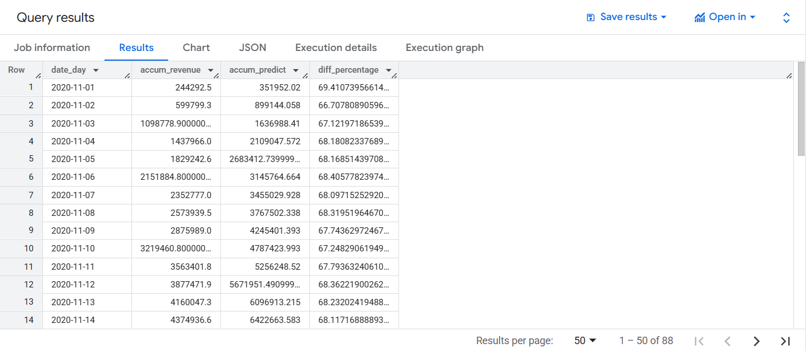
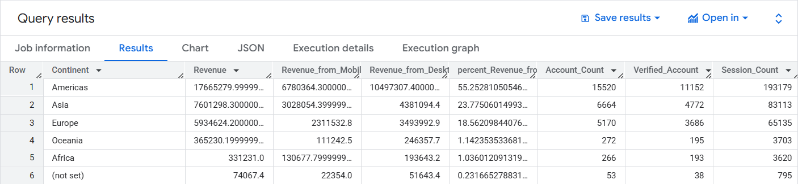
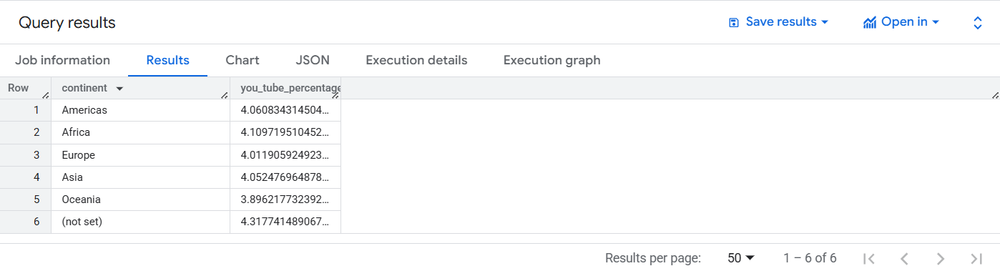

# SQL_Scripts
Analysis based on data from the database of an e-commerce furniture store

## 1. SQL_Email_data_CTE

**Objective:** 
- Calculate the percentage of emails that were sent to each account in a month out of the total number of emails.
- Determine the first and last date an email was sent to each account in the month.

**Result:**  

## 2. SQL_Prediction_Fulfillment

**Objective:** 
- Calculate the percentage of fulfillment of the accumulative income from the accumulative goals (predict) in the context of the day.

**Result:**

## 3. SQL_Revenue_by_Device_Continent_Sessions

**Objective:** 
- Calculate revenue by device and continent with sessions

**Result:**

## 4. SQL_YouTube_Events
Working with nested fields

**Objective:** 
- Calculate the percentage of page_title events that contain the word YouTube (from the event_params.key column) among all events with event records and display this percentage by continent.

**Result:**

